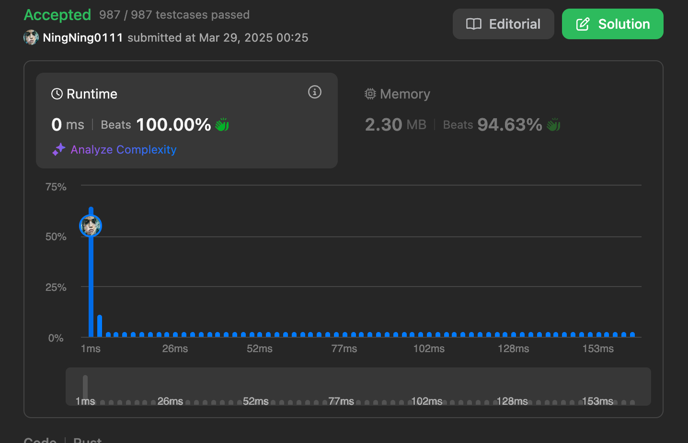

# 无重复字符的最大子树

## 题目描述

&emsp;给定一个字符串`s`,找出**不含有重复字符的最长子串的长度**。

## 思路

&emsp;以`abcabcbb`为例，定义两个指针`left`和`right`,分别表示窗口的左右两边，初始时均为`0`，考虑到去重，我们可以定义一个 Set 对象`sets`存储窗口内部的字符,然后遍历 r,`sets={a}`,`maxLen=1`:

第一步：

```
a b c a b c b b
l r

```

由于`sets`中不包含`s[r]`,因此可以将 b 添加到`sets`中,此时`sets={a,b}`,`maxLen = 2`；

第二步：

```
a b c a b c b b
l   r
```

由于`sets`中不包含`s[r]`,因此可以将 b 添加到`sets`中,此时`sets={a,b,c}`,`maxLen=3`;

第三步：

```
a b c a b c b b
l     r
```

由于`sets`中包含`s[r]`,如果将`s[r]`加入到`sets`中，则不满足无重复字符要求,因此需要将`s[l]`从`sets`中移除，`l++`此时`sets={b,c,a}`,`maxLen=3`;

第四步：

```
a b c a b c b b
  l     r
```

由于`sets`中包含`s[r]`,因此需要将`s[l]`从`sets`中移除，`l++`此时`sets={c,a,b}`,`maxLen=3`;

第五步：

```
a b c a b c b b
    l     r
```

由于`sets`中包含`s[r]`,因此需要将`s[l]`从`sets`中移除，`l++`此时`sets={a,b,c}`,`maxLen=3`;

第六步：

```
a b c a b c b b
      l     r
```

由于`sets`中包含`s[r]`,因此需要将`s[l]`从`sets`中移除，`l++`此时`sets={b,c}`,`maxLen=3`;

第七步：

```
a b c a b c b b
        l     r
```

由于`sets`中包含`s[r]`,因此需要将`s[l]`从`sets`中移除，`l++`此时`sets={c}`,`maxLen=3`;

最后，`r == len`,结束。

&emsp;在求解 maxLen 时，我们可以在结束当前遍历前计算 set 长度，然后更新。不过，我们不需要每次都去计算 set 长度，可以使用`right-left`就能得到滑动窗口的长度。

## 代码

### 滑动窗口 + Hash

```rust
use std::{collections::HashSet};

struct Solution;

impl Solution {
    pub fn length_of_longest_substring(s: String) -> i32 {
        let len = s.len();
        if len == 0 {
            return 0;
        }
        let (mut left, mut right, mut ans) = (0, 0, 0);
        let mut window = HashSet::<char>::new();
        let chars = s.chars().collect::<Vec<char>>();
        while right < len {
            if window.contains(&chars[right]) {
                window.remove(&chars[left]);
                left += 1;
            } else {
                window.insert(chars[right]);
                right += 1;
            }
            ans = ans.max(window.len());
        }
        ans as i32
    }
}

/// # Longest Substring Without Repeating Characters
#[cfg(test)]
pub mod test_3 {
    use crate::hot100::sliding_window::p3::Solution;

    #[test]
    fn test_p3() {
        // You can use `assert_eq!(target,Solution::function(args))` to call the function
        assert_eq!(
            3,
            Solution::length_of_longest_substring("abcabcbb".to_string())
        )
    }
}

```

## 优化

- 使用字节数组代替字符集合存储。数组的访问时间复杂度为`O(1)`,Set 的访问时间复杂度**平均是`O(1)`**,常数因子更小，访问更高效。
- 因为**可以确认输入只包含 ASCII 字符**，因此可以使用固定大小的数组([bool;128]，128 完全足够表示 ASCII 字符集)来表示一个滑动窗口，这比动态的 Set 内存分配和释放更快。

```rust
struct Solution;

impl Solution {

    pub fn length_of_longest_substring(s: String) -> i32 {
        let bytes = s.as_bytes();
        let len = bytes.len();
        let (mut left, mut right, mut max_len) = (0, 0, 0);
        let mut seen = [false; 128];
        while right < len {
            let c = bytes[right] as usize;
            if seen[c] {
                seen[bytes[left] as usize] = false;
                left += 1;
            } else {
                seen[c] = true;
                right += 1;
            }
            max_len = max_len.max(right - left);
        }
        max_len as i32
    }
}

/// # Longest Substring Without Repeating Characters
#[cfg(test)]
pub mod test_3 {
    use crate::hot100::sliding_window::p3::Solution;

    #[test]
    fn test_p3() {
        // You can use `assert_eq!(target,Solution::function(args))` to call the function
        assert_eq!(
            3,
            Solution::length_of_longest_substring("abcabcbb".to_string())
        )
    }
}
```


