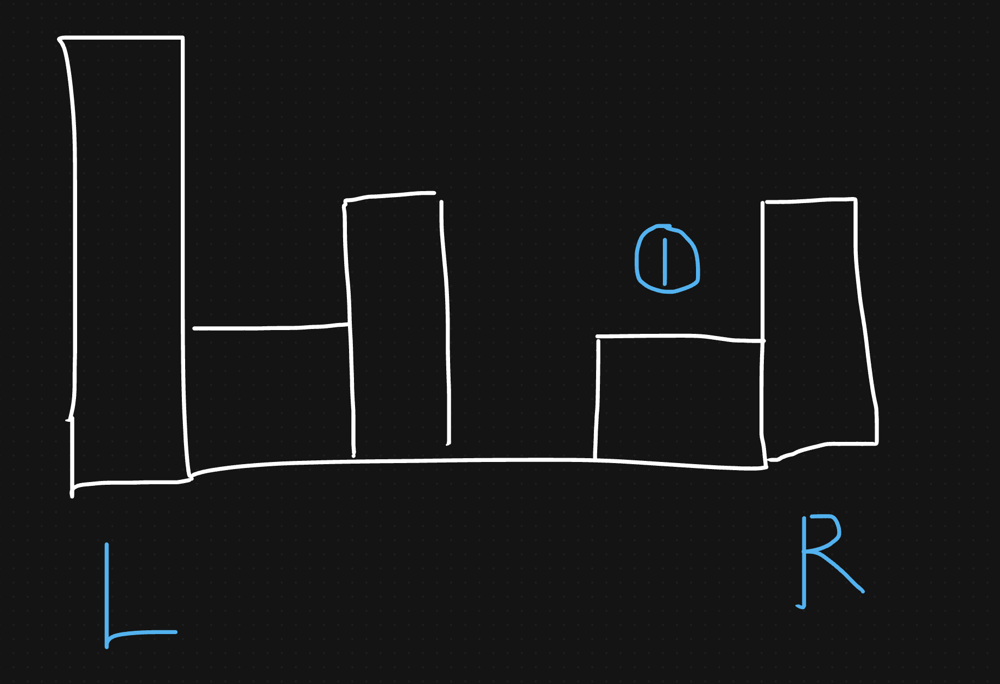
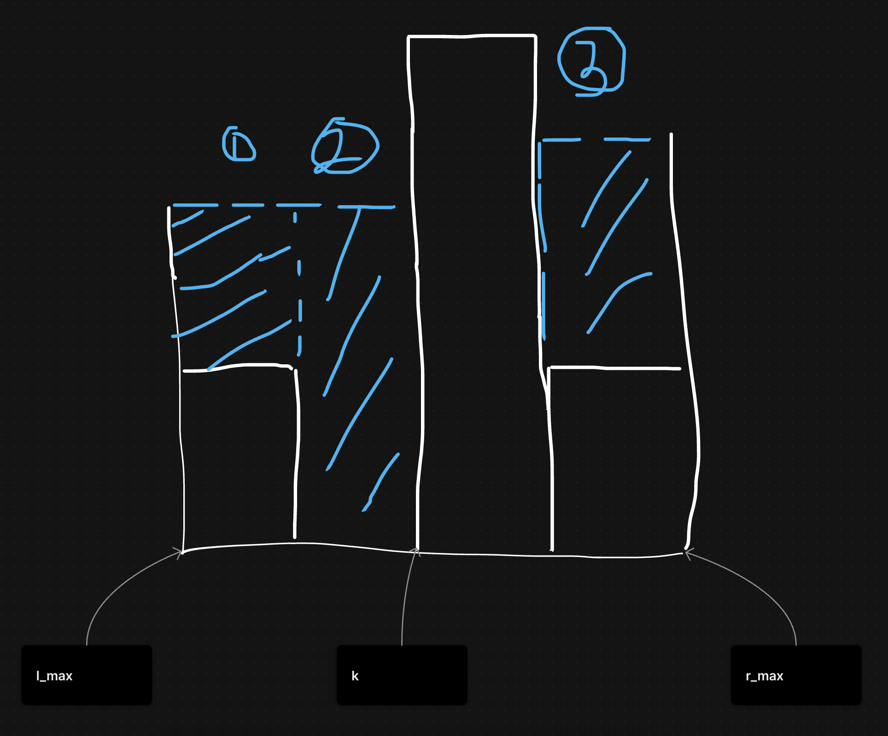
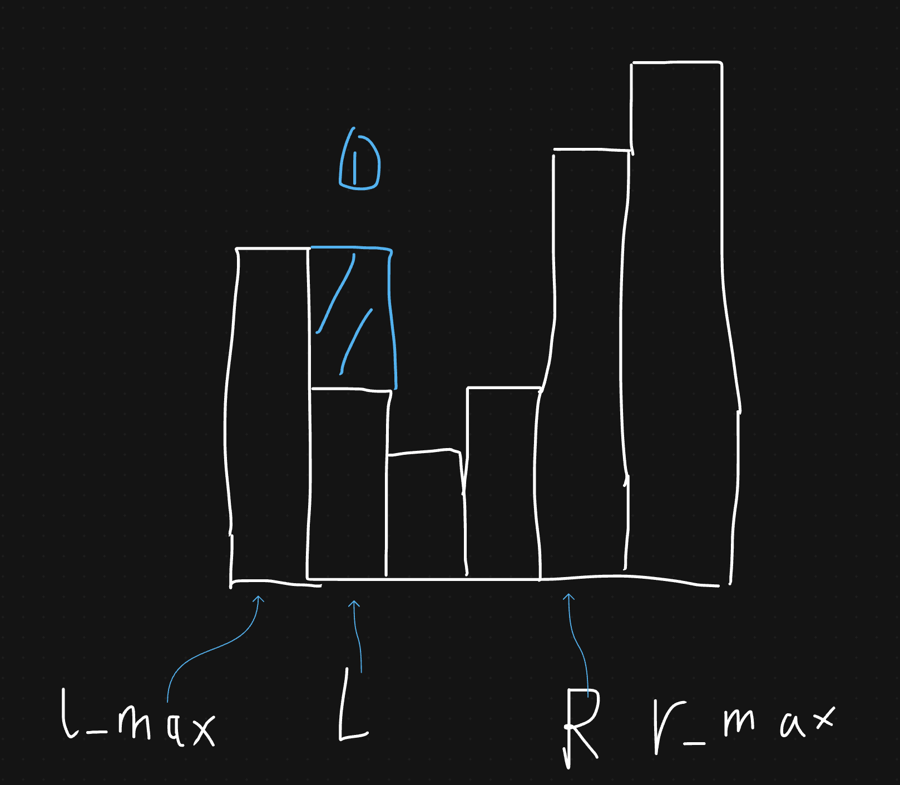

# 接雨水

&emsp;LeetCode 上著名的一道双指针问题。

## 题目描述

&emsp;给定 `n` 个非负整数表示每个宽度为 `1` 的柱子的高度图，计算按此排列的柱子，下雨之后能接多少雨水。

&emsp;例如:`height = [0,1,0,2,1,0,1,3,2,1,2,1]` 返回`6`。


## 分析

&emsp;首先，我们定义一个指针`left`和`right`分别指向左右两边，由于接到雨水的多少受短板效应的影响，所以在计算雨水数时，以最短的那边为主进行计算。如下图所示，右边相较于左边更短，因此我们以右边为主计算`1`区域。



&emsp;当出现下面这种情况时,会发现，基准短板会随着向中间遍历，可能会发生变化。因此，我们可以维护两个变量`l_max`和`r_max`分别表示`左边的最大高度`和`右边的最大高度`。下图中，`l`向右遍历到`k`时，`l_max`就等于`nums[k]`,此时，nums[r]就是短板，再以 r 为主，计算`3`区域即可。



## 思路

1. 定义两个指针`l`、`r`分别指向左右两边，同时维护两个变量`l_max`和`r_max`分别表示左右两边的最大高度。
2. 总的雨水量以左右两边最短的那个为基准，通过`最大高度-nums[i]`计算，然后求和出来的。比如：**nums[l] = 1, l_max = 2, r_max=6, num[r] = 5,我们以 l 为基准,通过 l_max-nums[l]即可计算出 nums[l]可以接到的雨水量**。



## 代码

```rust

struct Solution;

impl Solution {
    pub fn trap(height: Vec<i32>) -> i32 {
        let (mut l, mut l_max, mut r, mut r_max) =
            (0, height[0], height.len() - 1, height[height.len() - 1]);
        let mut ans = 0;
        while l < r {
            // 维护l_max 和 r_max
            l_max = l_max.max(height[l]);
            r_max = r_max.max(height[r]);
            // 依据短板效应 计算接到的雨水量
            if height[l] < height[r] {
                ans += l_max - height[l];
                l += 1;
            } else {
                ans += r_max - height[r];
                r -= 1;
            }
        }
        ans
    }
}

/// # Trapping Rain Water
#[cfg(test)]
pub mod test_42 {
    use crate::hot100::two_pointers::p42::Solution;

    #[test]
    fn test_p42() {
        // You can use `assert_eq!(target,Solution::function(args))` to call the function
        assert_eq!(6, Solution::trap(vec![0, 1, 0, 2, 1, 0, 1, 3, 2, 1, 2, 1]));
    }
}

```
