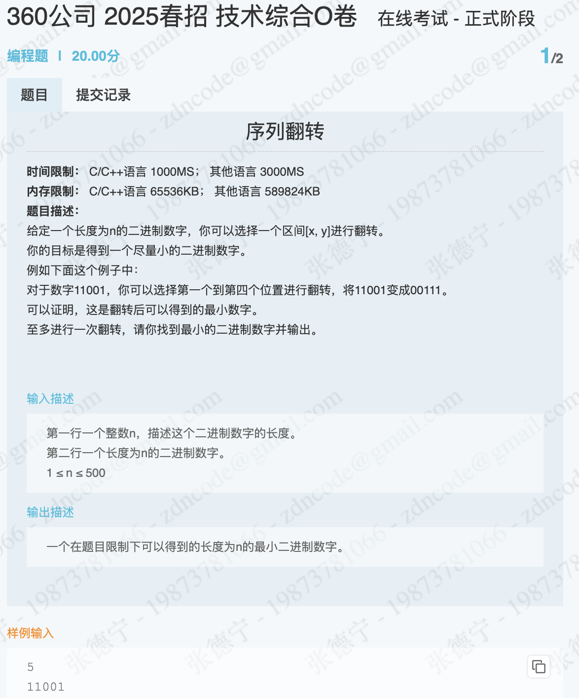
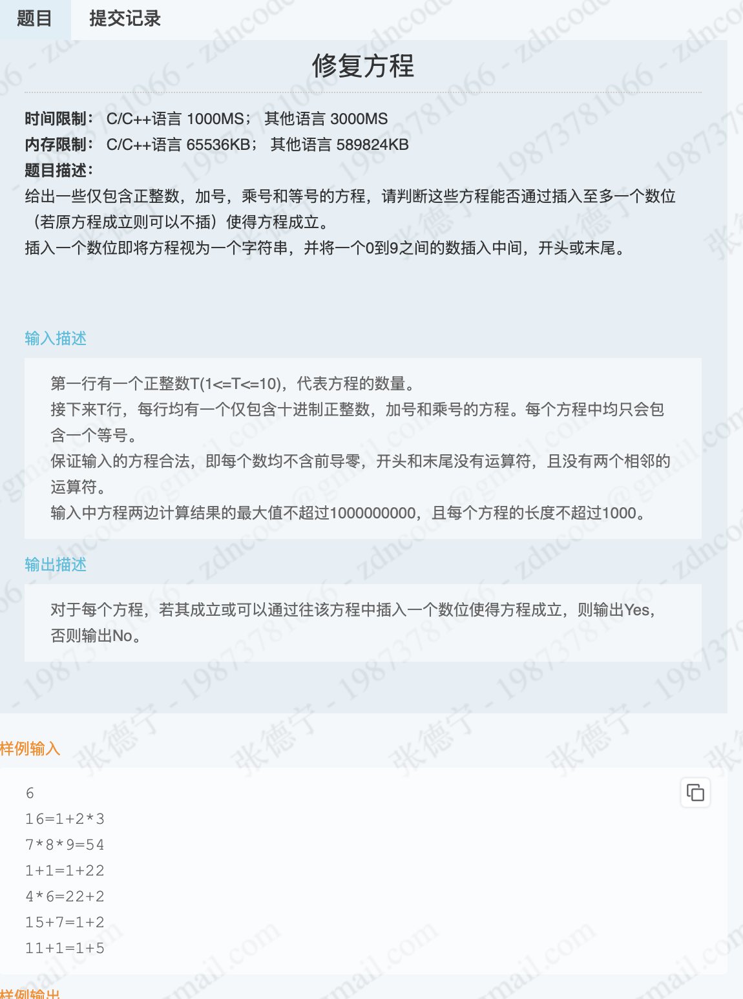

# 25 届春招 4 月 6 日

## 题目一：



### 代码

```rust
use std::io;

fn main() {
    let mut input = String::new();
    io::stdin().read_line(&mut input).expect("Failed to read line");
    let n: usize = input.trim().parse().expect("Failed to parse integer");

    let mut num_str = String::new();
    io::stdin().read_line(&mut num_str).expect("Failed to read line");
    let num_str = num_str.trim();

    println!("{}", handler(num_str, n));
}

fn handler(num_str: &str, len: usize) -> String {
    let mut min_num_str = num_str.to_string();
    for i in 0..len {
        for j in i..len {
            // flip
            let flip_str = flip(num_str, i, j);
            if flip_str < min_num_str {
                min_num_str = flip_str;
            }
        }
    }
    min_num_str
}

fn flip(num_str: &str, start: usize, end: usize) -> String {
    let mut chars: Vec<char> = num_str.chars().collect();
    let mut start = start;
    let mut end = end;
    while start < end {
        chars.swap(start, end);
        start += 1;
        end -= 1;
    }
    chars.into_iter().collect()
}
```

## 题目二



### 代码：

```rust
fn main() {
    let mut input = String::new();
    io::stdin().read_line(&mut input).expect("读取失败");
    let n: usize = input.trim().parse().expect("解析数字失败");

    for _ in 0..n {
        let mut function_str = String::new();
        io::stdin().read_line(&mut function_str).expect("读取失败");
        let function_str = function_str.trim();

        if is_function(function_str) {
            println!("Yes");
        } else {
            println!("No");
        }
    }
}

fn is_function(function_str: &str) -> bool {
    if let Some((left, right)) = function_str.split_once('=') {
        if evaluate_expression(left) == evaluate_expression(right) {
            return true;
        }
    }

    // 尝试在所有位置插入数字
    for i in 0..=function_str.len() {
        for num in 0..=9 {
            let new_str = format!("{}{}{}", &function_str[..i], num, &function_str[i..]);
            if let Some((left, right)) = new_str.split_once('=') {
                if evaluate_expression(left) == evaluate_expression(right) {
                    return true;
                }
            }
        }
    }
    false
}

fn evaluate_expression(expr: &str) -> i64 {
    expr.split('+')
        .map(|term| {
            term.split('*')
                .map(|num| num.parse::<i64>().unwrap_or(0))
                .product::<i64>()
        })
        .sum()
}
```

## 笔试情况

&emsp;两道简单的模拟题全 AC。
