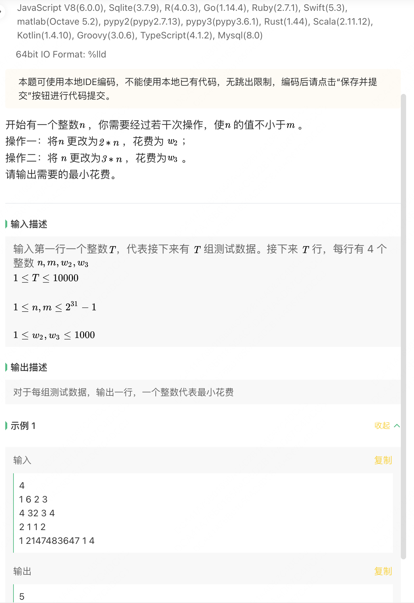
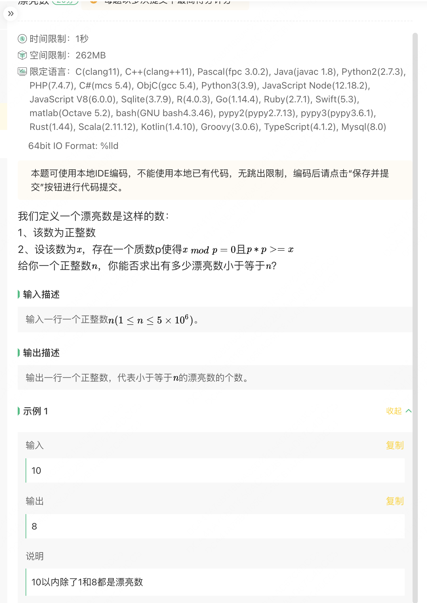
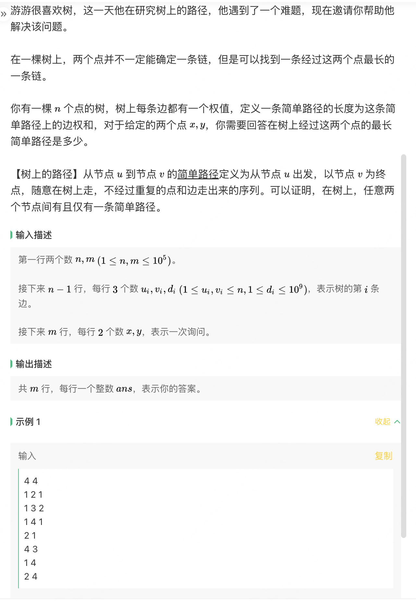

# 美团-25 届春招-0405

## 题目一



### 代码

```java
import java.util.Scanner;

/**
 * 开始有一个整数n,你需要经过若干次操作使n的值不小于m
 * 操作一：将n更改为2*n
 * 操作二：将n更改为3*n
输入：
4
1 6 2 3
4 32 3 4
2 1 1 2
1 2147483647 1 4
输出：
5
8
0
31
范围：
1<=n,m<=2^31-1
1<=w2,w3<=1000
 */
public class Main1 {

    // 使用 BFS 搜索 找到最小操作数
    private static long minOperations(long n, long m, int w2, int w3) {
        if (n >= m) return 0;
        java.util.Queue<long[]> queue = new java.util.LinkedList<>();
        java.util.Set<Long> visited = new java.util.HashSet<>();
        queue.offer(new long[]{n, 0});
        visited.add(n);

        long minSteps = Long.MAX_VALUE;
        // BFS 搜索
        while (!queue.isEmpty()) {
            long[] current = queue.poll();
            long currentN = current[0];
            long currentSteps = current[1];

            // 操作1 乘2
            long nextN2 = currentN * 2;
            if (nextN2 > 0 && !visited.contains(nextN2)) {
                if (nextN2 >= m) {
                    minSteps = Math.min(minSteps, currentSteps + (long) w2);
                } else {
                    queue.offer(new long[]{nextN2, currentSteps + (long) w2});
                    visited.add(nextN2);
                }
            }

            // 操作2 乘3
            long nextN3 = currentN * 3;
            if (nextN3 > 0 && !visited.contains(nextN3)) {
                if (nextN3 >= m) {
                    minSteps = Math.min(minSteps, currentSteps + (long)w3);
                } else {
                    queue.offer(new long[]{nextN3, currentSteps + (long)w3});
                    visited.add(nextN3);
                }
            }
        }
        return minSteps == Long.MAX_VALUE ? -1 : minSteps;
    }

    public static void main(String[] args) {
        Scanner scan = new Scanner(System.in);
        int tN = scan.nextInt();
        scan.nextLine(); // 读取换行符
        for (int testCase = 0; testCase < tN; testCase++) {
            String[] nums = scan.nextLine().split(" ");
            long n = Integer.parseInt(nums[0]);
            long m = Integer.parseInt(nums[1]);
            int w2 = Integer.parseInt(nums[2]);
            int w3 = Integer.parseInt(nums[3]);
            // handle
            long result = minOperations(n, m, w2, w3);
            System.out.println(result);
        }
        scan.close();
    }
}

```

## 题目二



### 代码(超时，20%)

```java
import java.util.Arrays;
import java.util.Scanner;
/**
 * 定义漂亮数：
 * 1、该数为正整数
 * 2、设该数为x，存在一个质数p使得x%p==0 且 p*p >= x
 * 给定一个整数n，求[1,n]中有多少个漂亮数
 * 输入：
 * 10
 * 输出：
 * 8
 * 范围:
 * 1<=n<=5*10^6
 */
public class Main2 {
    public static void main(String[] args) {
        Scanner scan = new Scanner(System.in);
        int n = scan.nextInt();
        System.out.println(countNumber(n));
    }
    private static int countNumber(int n) {
        // 筛选质数
        boolean[] isPrime = new boolean[n + 1];
        Arrays.fill(isPrime, true);
        isPrime[0] = isPrime[1] = false;
        for(int i = 2; i * i <= n; i++){
            if(isPrime[i]) {
                for(int j = i * i; j <= n; j += i){
                    isPrime[j] = false;
                }
            }
        }
        int count = 0;
        for(int i = 1; i <= n; i++) {
            for(int p = 2; p <= i; p++) {
                if(isPrime[p] && i % p == 0 && p * p >= i) {
                    count++;
                    break;
                }
            }
        }
        return count;
    }
}
```

## 题目三


