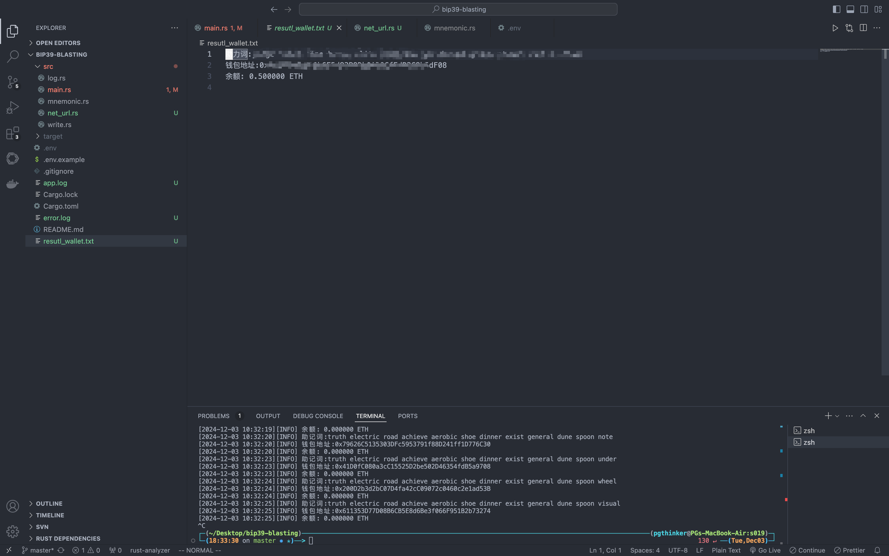

## 介绍

&emsp;大一大二那会儿非常热爱算法，在 LeetCode、洛谷、蓝桥杯、PTA、CF 等等 OJ 网站都有刷过，使用的语言主要是 C++，其中 LeetCode 500+，落谷 260+、蓝桥杯 200+、PTA 100+、CF 30+等。期间也拿了不少奖项，像比较水的 ACM 西部赛（铜）、蓝桥杯（A 省二）、天梯赛（团队省一）等等。

&emsp;不过，虽然我十分热爱算法，但是算法并不怎么友好地对待我，大一大二那段时间完全没有人带，只靠自己摸索，走了很多很多弯路，刷了这个忘了那个的情况时常有，再加上大三那会儿专注于提升技术，拓展技术栈，渐渐地就不再坚持刷算法题了。

&emsp;我从 24 年 9 月份开始学习 Rust，其实在很早之前就通过 X 知道了这门语言，那会儿给我印象最深的就是各种形式的螃蟹 🦀 夹着各类语言的吉祥物，只能说那会儿 Rust 在国外已经很火了。

&emsp;我编写的第一个 Rust 项目是一个[以太坊钱包爆破的程序](https://github.com/NingNing0111/bip39-blasting)。**这个程序会在启动时随机打乱 2048 个单词的顺序，然后按照排列组合构建 12 个助记词，生成钱包地址，然后查询钱包是否有钱（单位 ETH）进行钱包信息存储**。我在测试网上测试得没问题，可以成功获取到测试网的钱包地址及余额，不过在正式网中，跑了三天，还从来没有爆破出来过。在编写完这个程序后的几天里，时常会幻想爆破出 0.1 个 ETH，也算是大赚特赚了（1ETH = 2,088 US）。

&emsp;第二个 Rust 项目就是我的毕业设计了。我的毕设设计是基于 Protobuf 实现一款 C/S 内网穿透工具-[Loo](https://github.com/NingNing0111/Loo)，早期 C/S 端都是由 Java 实现，后面考虑到软件的易用性，想将 Client 端开发成一个桌面应用程序。最开始想用 Flutter，但是目前 Dart 生态还没有适合的、成熟的异步网络编程的库，并且 Client 应该要具有高效性、需要更偏底层。C/C++过于底层，Go 暂时没有跨平台的应用开发框架，于是就选择 Rust。

&emsp;因为**Rust 是内存安全的、系统级的编程语言，程序执行效率更高；在跨平台方面，有 Tauri 框架，可以无缝集成前端代码；异步编程上，还有 Tokio，Tokio 基本占据了 Rust 异步编程的大半江山**。

&emsp;后面，我就开始用 Rust 写一些工具（如 Excel、命令行工具）。其中命令行工具包括`代码片段推送`、`LeetCode 本地代码模板初始化`。随着在生活中使用 Rust 的次数增多，渐渐的，我也逐渐喜欢上了这门语言。

&emsp;Rust 作为一门系统级语言，在保障内存安全的同时提供高性能，因此高效的数据结构和算法设计至关重要。合理的数据结构选择能够减少内存分配，提高访问速度，而高效的算法则可以优化计算复杂度，提升程序运行效率。

&emsp;Rust 的所有权机制、借用检查器以及零成本抽象使其在数据结构实现方面具有独特的优势。例如，`Vec<T>` 提供了动态数组的能力，`HashMap<K, V>` 高效地支持键值存储，而 `BTreeMap<K, V>` 适用于范围查询和有序存储。更重要的是，Rust 的 `Option<T>` 和 `Result<T, E>` 类型能够显式处理空值和错误，避免空指针引用问题，增强了数据结构的安全性。

&emsp;在系统编程、并发计算和嵌入式开发等领域，合理选择和实现数据结构能直接影响程序的可维护性和性能。例如，在多线程环境中，Rust 提供了 `Arc<T>` 进行原子引用计数，`Mutex<T>` 和 `RwLock<T>` 进行线程同步，结合 `async/await` 还能高效管理异步数据流。

## 关于本站

&emsp;主要记录 Rust 的数据结构与算法、个人 LeetCode 刷题笔记等。

## 注意事项

- 若出现一些异常的特殊符号，可能是因为 Latex 渲染异常，刷新浏览器试试。

## 其它工具

- 本地 LeetCode 模板生成器：[leinit](https://github.com/NingNing0111/leinit)
